# Лабораторная работа 7  
_Анализ и преобразование кода с использованием Clang и LLVM_

## Цель

Познакомиться с инструментарием Clang и LLVM, освоить получение абстрактного синтаксического дерева (AST) и промежуточного представления (LLVM IR) для кода на C/C++, научиться применять базовые оптимизации, строить графы потока управления (CFG), а также анализировать влияние оптимизаций на различные синтаксические конструкции языка.

## Автор
_Студентка: Коробейникова Дарья Романовна\
Дисциплина: Теория формальных языков и компиляторов\
Год разработки: 2026_

## Постановка задачи

Необходимо выполнить следующие шаги:

1. **Установка среды**  
   Установить Clang, LLVM, opt и Graphviz.

2. **Работа с AST**  
   Сгенерировать абстрактное синтаксическое дерево для заданного C‑файла.

3. **Генерация LLVM IR**  
   Получить промежуточное представление кода без оптимизаций (-O0) и с оптимизациями (-O2).

4. **Оптимизация IR**  
   Применить оптимизации с помощью opt и/или флагов Clang, сравнить изменения.

5. **Построение CFG**  
   Построить граф потока управления для функции main.

6. **Индивидуальное задание**  
   Выполнить анализ конкретной синтаксической конструкции в соответствии с вариантом.  
   Сформулировать, как LLVM обрабатывает глобальную целочисленную константу, какие оптимизации применяются и когда происходит подстановка константы.

7. **Выводы**  
   Ответить на контрольные вопросы.

## Общее задание

### 1. Установка среды

Установка Clang, LLVM, opt и Graphviz:

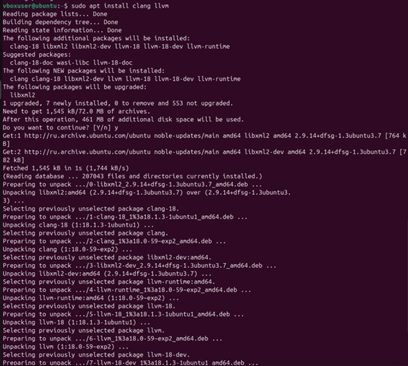  
*Рисунок 1 – Установка*

### 2. Исходный код

    #include <stdio.h>
    
    int square(int x) {
        return x * x;
    }
    
    int main() {
        int a = 5;
        int b = square(a);
        printf("%d\n", b);
        return 0;
    }

### 3. Работа с AST

Для получения дерева используется флаг -ast-dump:

    clang -Xclang -ast-dump -fsyntax-only main.c

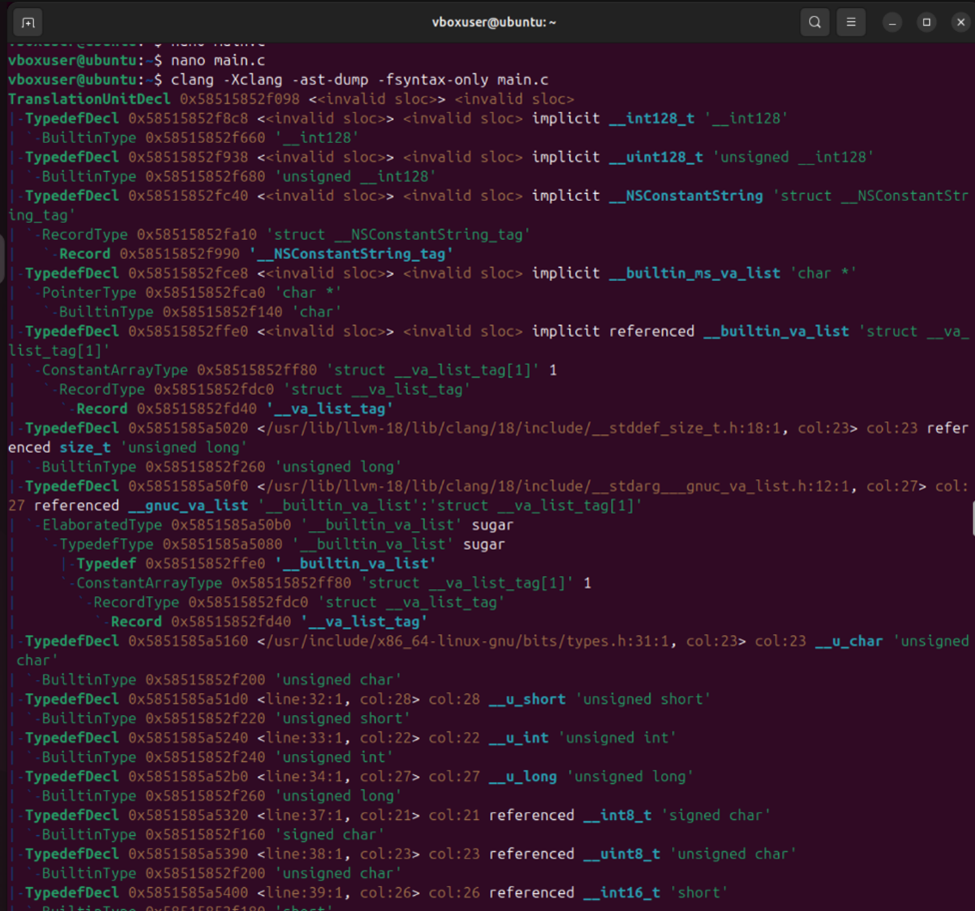  
*Рисунок 2 – AST-дамп*

### 4. Генерация LLVM IR

    clang -S -emit-llvm main.c -o main.ll

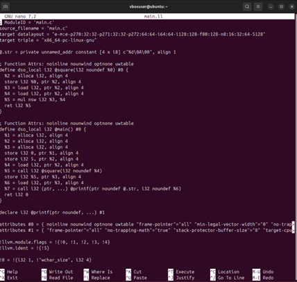  
*Рисунок 3 – main.ll*

### 5. Оптимизация IR

Сравнение -O0 и -O2:

    clang -S -emit-llvm -O0 main.c -o main_O0.ll
    clang -S -emit-llvm -O2 main.c -o main_O2.ll
    diff main_O0.ll main_O2.ll

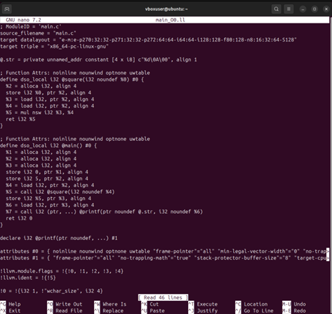  
*Рисунок 4 – main_O0.ll*

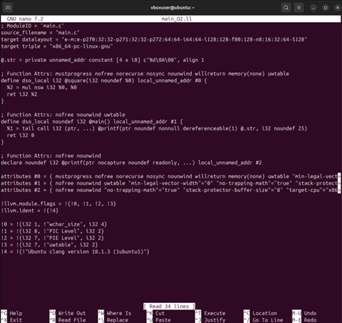  
*Рисунок 5 – main_O2.ll*

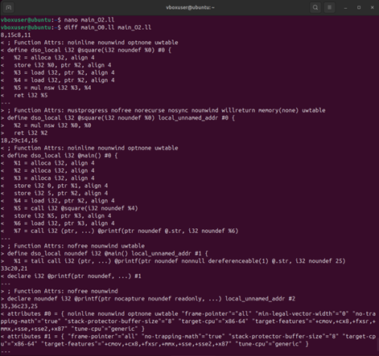  
*Рисунок 6 – Сравнение -O0 и -O2*

### 6. Построение CFG

Генерация .dot-файлов и преобразование в PNG:

    clang -O2 -S -emit-llvm main.c -o main.ll
    opt -passes="dot-cfg" main.ll -disable-output
    dot -Tpng .main.dot -o cfg_main.png
    dot -Tpng .square.dot -o cfg_square.png

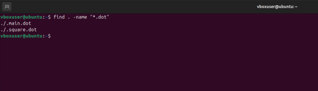  
*Рисунок 7 – Файлы .dot*

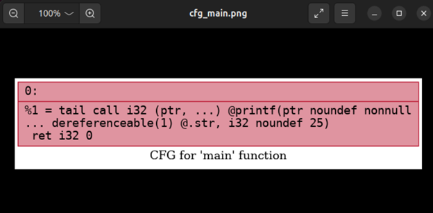  
*Рисунок 8 – CFG для main*

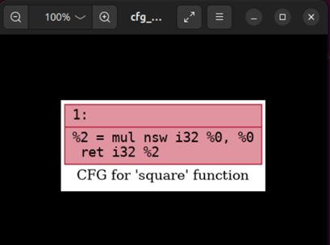  
*Рисунок 9 – CFG для square*

## Индивидуальное задание

**Анализ фрагмента кода с целочисленной константой и циклом.**

### Исходный код (const.c)

    const int LIMIT = 100;
    
    int main() {
        int sum = 0;
        for (int i = 0; i < LIMIT; ++i) {
            sum += i;
        }
        return sum;
    }

### 1. IR для -O0

    clang -O0 -S -emit-llvm const.c -o const_O0.ll

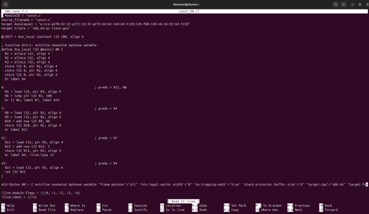  
*Рисунок 10 – const_O0.ll*
  
Константа LIMIT сохраняется в IR как глобальная переменная (@LIMIT = dso_local constant i32 100).  
Все обращения к ней производятся через load, цикл реализован явными инструкциями br, icmp и add.  
Нет никакой подстановки значения.

### 2. IR для -O2

    clang -O2 -S -emit-llvm const.c -o const_O2.ll

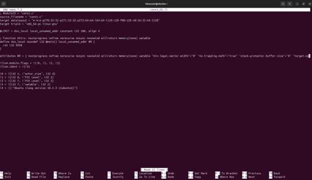  
*Рисунок 11 – const_O2.ll*

Переменная LIMIT полностью исчезает из IR. Граница цикла становится непосредственной константой 100, при этом цикл не размотан (компилятор вычисляет сумму 0+1+...+99 = 4950 на этапе компиляции и заменяет весь цикл на ret i32 4950).  
Таким образом, произошло полное свёртывание константы и последующее вычисление константного выражения.

Сравнение с -O0:

    diff const_O0.ll const_O2.ll

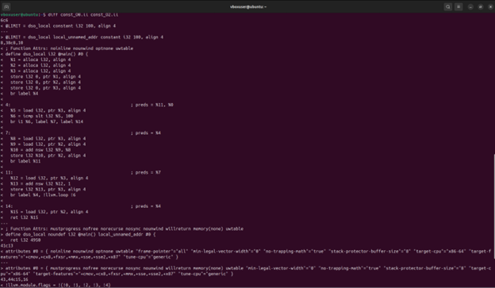  
*Рисунок 12 – Сравнение const_O0.ll и const_O2.ll*

### 3. Применение проходов -constprop (аналог sccp) и -ipsccp

> - В современных версиях LLVM constprop заменён на sccp.  
> - sccp выполняет внутрипроцедурное распространение констант.  
> - ipsccp – межпроцедурное распространение констант.

    clang -O0 -S -emit-llvm const.c -o const_O0.ll
    opt -passes=sccp -S const_O0.ll -o const_sccp.ll
    opt -passes=ipsccp -S const_O0.ll -o const_ipsccp.ll

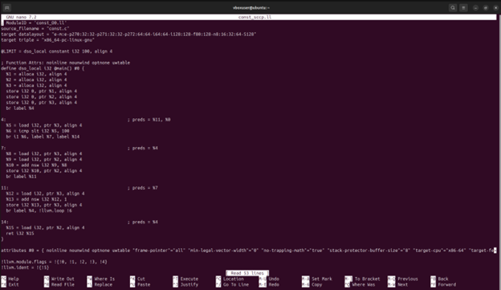  
*Рисунок 13 – const_sccp.ll*

  
*Рисунок 14 – const_ipsccp.ll*

- sccp не смог полностью убрать LIMIT, так как глобальная константа находится вне функции.  
- ipsccp (межпроцедурный) сумел распространить значение 100 в функцию main, заменив load на непосредственное значение, после чего другие проходы вычислили сумму цикла и свернули его в константу.  
Таким образом, для глобальной константы необходим именно межпроцедурный анализ.

### 4. Сравнение CFG до и после оптимизаций

Построение CFG для const_O0.ll и const_O2.ll:

    # Неоптимизированный
    opt -passes=dot-cfg -disable-output const_O0.ll
    dot -Tpng .main.dot -o cfg_O0.png
    
    # Оптимизированный (-O2)
    opt -passes=dot-cfg -disable-output const_O2.ll
    dot -Tpng .main.dot -o cfg_O2.png

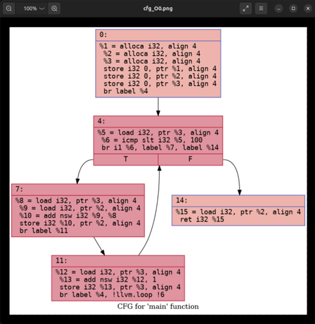  
*Рисунок 15 – cfg_O0.png*

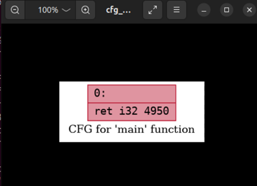  
*Рисунок 16 – cfg_O2.png*

- CFG для -O0: содержит один блок entry, внутри которого ~15 инструкций (alloca, load, вычисления, цикл).  
- CFG для -O2: также один блок entry, но внутри всего одна инструкция ret i32 4950.  
Весь цикл и все обращения к LIMIT исчезли.

### 5. Вывод: как и когда константа подставляется?

- На уровне -O0 константа сохраняется как глобальная переменная в памяти, подстановка не выполняется.  
- Включение оптимизаций запускает цепочку проходов:  
  - сначала межпроцедурный анализ (ipsccp) распространяет значение LIMIT внутрь функции main;  
  - затем проходы свёртки инструкций и удаления мёртвого кода превращают цикл в константу 4950.  
- Локальный constprop (sccp) не может обработать глобальную константу, так как работает только внутри одной функции.

**Вывод:** Константа подставляется на этапе оптимизаций LLVM IR, а не на этапе синтаксического анализа. Для глобальных констант обязателен межпроцедурный анализ, иначе значение останется в памяти.

## Контрольные вопросы 

1. Что такое Clang, и какова его роль в процессе компиляции программ?
Clang — это фронтенд компилятора для языков C, C++ и Objective-C. Он выполняет лексический, синтаксический и семантический анализ, строит AST, генерирует LLVM IR и выдаёт диагностические сообщения. Clang не генерирует машинный код напрямую, а передаёт IR далее в LLVM.

2. Что представляет собой LLVM и как он используется в современных компиляторах?
LLVM — это инфраструктура для разработки компиляторов, включающая промежуточное представление (IR), набор оптимизирующих проходов и бэкенды для различных архитектур. Современные компиляторы (Clang, Rustc, Swiftc) используют LLVM как единый оптимизатор и генератор кода: фронтенд создаёт IR, LLVM оптимизирует его и транслирует в машинный код.

3. Чем отличается абстрактное синтаксическое дерево (AST) от промежуточного представления LLVM IR?
AST сохраняет высокоуровневую структуру исходного языка (деревья выражений, операторов, объявлений) и зависит от конкретного языка. LLVM IR — низкоуровневое представление, близкое к ассемблеру, в SSA-форме; оно не зависит от языка и от целевой архитектуры.

4. Для чего необходимо промежуточное представление (IR) в процессе компиляции?
IR обеспечивает единый формат для всех фронтендов и бэкендов, независимость от языка и архитектуры, многократные оптимизации, а также облегчает отладку и анализ. Благодаря IR оптимизаторы пишутся один раз для всех поддерживаемых языков и платформ.

5. Что делает инструкция alloca в LLVM IR, и зачем она используется в функциях?
Инструкция alloca выделяет память на стеке текущей функции и возвращает указатель. Она используется для размещения локальных переменных, особенно на этапе -O0, чтобы упростить кодогенерацию. При оптимизациях alloca часто заменяется на SSA-регистры или удаляется.

6. Зачем нужна оптимизация кода в компиляторе, и какие основные цели она преследует?
Оптимизация улучшает свойства программы без изменения её смысла. Цели: увеличение скорости выполнения, уменьшение размера кода, снижение энергопотребления, лучшее использование регистров и кэша.

7. Что такое SSA-форма и почему она важна при оптимизации программ?
SSA (Static Single Assignment) — форма, в которой каждая переменная имеет ровно одно определение. При ветвлениях используются φ-функции. SSA-форма упрощает анализ потока данных и даёт возможность эффективно выполнять распространение констант, удаление мёртвого кода, копирование и другие оптимизации.

8. Что такое граф потока управления (CFG) и как он помогает анализировать поведение программы?
CFG (Control Flow Graph) — это ориентированный граф, где вершины — базовые блоки (линейные последовательности инструкций), а рёбра — возможные переходы между ними. CFG позволяет визуализировать пути выполнения, выявлять недостижимые блоки, анализировать циклы и ветвления, а также проводить оптимизации, зависящие от потока управления.

9. Как устроено представление арифметических операций в LLVM IR (например, умножение, сложение)?
Арифметические операции представляются трёхадресными инструкциями с указанием типа и флагами переполнения (nsw, nuw). Примеры: %res = add i32 %a, %b (целочисленное сложение), %res = mul i32 %a, %b (умножение), %res = fadd double %x, %y (с плавающей точкой). Результат всегда записывается в новую SSA-переменную.

10. Почему функции в LLVM IR обычно представляют собой отдельные единицы анализа и оптимизации?
Функции естественным образом изолируют данные и управление: локальные переменные и alloca не видны вне функции. Это позволяет выполнять оптимизации локально, параллельно и независимо. Функция также является стандартной единицей для инлайнинга, распространения констант (внутрипроцедурного) и выделения регистров.

11. Что происходит с функцией в LLVM IR, если она вызывается один раз и очень короткая?
При включённых оптимизациях (например, -O2) компилятор, скорее всего, выполнит инлайнинг — встроит тело функции в место вызова. Это устраняет накладные расходы на вызов и открывает дополнительные возможности для последующих оптимизаций (свёртка констант, удаление мёртвого кода).

12. Какие преимущества даёт использование IR и CFG для автоматических оптимизаций по сравнению с анализом исходного текста на C?
IR и CFG предоставляют низкоуровневое, языконезависимое и архитектурно-независимое представление с явными переходами и типизацией. Это позволяет реализовывать универсальные оптимизирующие проходы, которые работают для любых языков (C, C++, Rust и др.) и целевых процессоров, без переписывания оптимизаций под каждый новый язык или платформу. Анализ исходного текста на C требует учёта сложного синтаксиса, препроцессора, алиасинга и undefined behavior, что существенно сложнее и менее надёжно.
